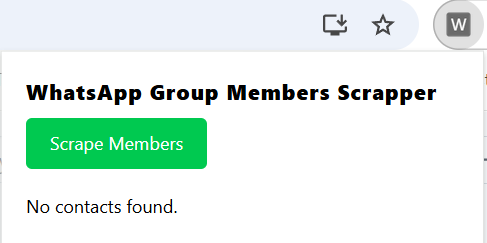

# WhatsApp Group Scraper Chrome Extension

## 🚀 Introduction

The **WhatsApp Group Scraper** is a Chrome extension designed to extract participant data from WhatsApp groups. It helps users gather useful insights from group members while ensuring privacy compliance.

## 🔥 Features

- Scrape WhatsApp group members' names and phone numbers (if visible)
- Export data as CSV
- Easy-to-use Chrome extension UI
- Fast and efficient data extraction

## Installation Guide

### Option 1: Use Pre-Built Extension (No Modifications Needed)

1. **Download the Project**:

   - Download the project as a `.zip` file from the repository.
   - Unzip the folder to a location on your computer.
     <br/>
     

2. **Load the Extension in Chrome**:
   - Open Chrome and go to `chrome://extensions/`.
   - Enable **Developer mode** in the top-right corner.
   - Click **Load unpacked** and select the `dist` folder from the unzipped project.
     <br>
     
     <br>
   - The extension is now ready to use!
     <br>
     

---

### Option 2: Build the Extension from Source (For Modifications)

#### Prerequisites:

Before installing the extension, ensure you have the following:

- [Node.js](https://nodejs.org/) (v16 or higher recommended)
- [npm](https://www.npmjs.com/) (usually comes with Node.js)
- Google Chrome browser

#### Instructions:

1. **Clone the Repository**:

   ```bash
   git clone https://github.com/qtecsolution/whatsapp-group-scraper.git
   cd whatsapp-group-scraper

   ```

2. **Install Dependencies**:
   ```bash
   npm install
   ```
3. **Make Modifications (Optional)**:

   - Modify the code as needed for your use case.

4. **Build the Extension**:

   ```bash
   npm run build
   ```

   - This generates the `dist` folder containing the built extension.

5. **Load the Extension in Chrome**:

   - Open Chrome and go to `chrome://extensions/`.
   - Enable **Developer mode** in the top-right corner.
   - Click **Load unpacked** and select the `dist` folder from the project.

   The extension is now ready to use with your changes.

## 🛠️ Usage

1. Open WhatsApp Web (`https://web.whatsapp.com/`).
2. Navigate to any group.
3. Click on the **WhatsApp Group Scraper** extension icon.
4. Click **Start Scraping**.
5. It will scrap those contacts which are visible on your screen.
6. Scroll contacts and click the **Start Scraping** button again. [Do it until you get all contacts match the scrap counts and the number of group members]
7. Download the extracted data as a CSV file.

## ⚠️ Disclaimer

- This tool is intended for **educational purposes only**.
- Do not use it for spamming or violating WhatsApp's terms of service.
- Use at your own risk.

## 🤝 Contributing

We welcome contributions! To contribute:

1. Fork the repository.
2. Create a new branch (`git checkout -b feature-name`).
3. Commit changes (`git commit -m 'Add new feature'`).
4. Push to the branch (`git push origin feature-name`).
5. Open a Pull Request.

   <b>Our Team will review and merge your request</b>

## Troubleshooting

#### Extension Not Loading

- Ensure you have enabled **Developer mode** in `chrome://extensions/`.
- Make sure you are selecting the correct `dist` folder after building the project.

#### Build Errors

- Ensure all dependencies are installed by running `npm install`.
- Check for any syntax errors or missing files in your code.

## Notes

- Ensure you comply with WhatsApp [Terms of Service](https://www.whatsapp.com/legal/terms-of-service) when using this extension.
- This extension is intended for educational and ethical use only.

## FAQs

### Q1. Is this extension safe to use?

**Ans:** Yes, the extension runs locally in your browser and does not send data to external servers. However, always ensure you comply with WhatsApp Terms of Service.

### Q2. Can I modify the CSV output format?

**Ans:** Yes, you can modify the code in the `src` folder to customize the CSV output. After making changes, rebuild the extension using `npm run build`.

## 📜 License

This project is licensed under the MIT License. See the [LICENSE](LICENSE) file for details.

## 📧 Support

If you encounter any issues or have questions, feel free to reach out through the following channels:

- Open an issue on the [GitHub repository](https://github.com/qtecsolution/whatsapp-group-scraper).
- **Call for Queries**: +8801313522828 (WhatsApp)
- **Contact Form**: [Qtec Solution Contact Page](https://qtecsolution.com/contact-us)
- **Email**: [info@qtecsolution.com](mailto:info@qtecsolution.com)

---

## Follow Us on Social Media

Stay updated with the latest news, updates, and releases:

 <br>
[](https://qtecsolution.com/Qtec-Solution-Limited-Portfolio.pdf)
[](https://www.facebook.com/QtecSolution/)
[](https://www.instagram.com/qtecsolution/)
[](https://www.linkedin.com/company/qtec-solution)
[](https://twitter.com/qtec_solution)
[](https://www.youtube.com/@qtecsolutionlimited)
[](https://qtecsolution.com/)

### ⭐ If you find this project useful, please give it a star!
